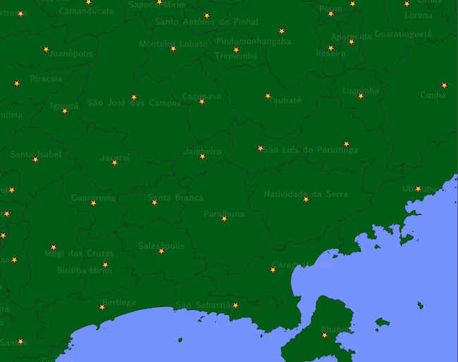

**********************
Get and Plot Centroids
**********************

Script para gerar centroids de polígonos a partir de um *shapefile*.

[en] Generated centroids (points) from polygons *shapefiles* while copying all source attributes to the new sahpefile attributes.

[pt] Gera "centroids" (pontos) a partir de um *shapefile* de polígonos, copiando todos os atributos para o novo shapefile.

Usage:

.. code-block:: bash

    # in your shell
    $ python3 getplot_centroids -f <path-to-shapefile.SHP>

Result
======

The result is a new *shapefile* containing 1 layer of points (cetroids)

.. image:: docs/imgs/shape_file_br_centroids_attrs.png
    :width: 400
    :alt: QGIs layers: Polygons and Centroids (Points)

