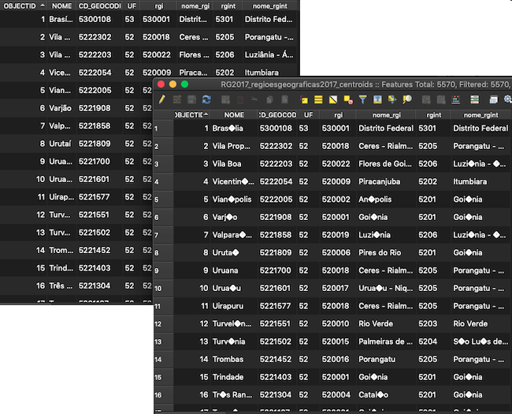
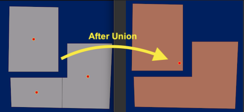

    The main goal is to have a VERY simple tool to make small operations on shapefiles from the shell

*********
Centroids
*********

Script para gerar "centroids" de polígonos a partir de um *shapefile*.

Os atributos da "feature" (registro) são copiados dos polígonos para os pontos

[en] Generated centroids (points) from polygons *shapefiles* while copying all source attributes to the new sahpefile attributes.

[pt] Gera "centroids" (pontos) a partir de um *shapefile* de polígonos, copiando todos os atributos para o novo shapefile.

Usage:

.. code-block:: bash

    # in your shell
    $ python3 getplot_centroids -f <path-to-shapefile.SHP>

Result
======

The result is a new *shapefile* containing 1 layer of points (cetroids)

+-------------------------------------------------+--------------------------------------------------+
| Polygons                                        | Centroids                                        |
+=================================================+==================================================+
| .. image:: docs/imgs/shape_file_br_polygons.png | .. image:: docs/imgs/shape_file_br_centroids.png |
+-------------------------------------------------+--------------------------------------------------+

All the attibutes are copied too to the new shape

UNION
=====

Unifica Geometrias de Polígonos

GDAL on MAC OS Mojave
====================

.. code-block:: bash

    $ brew install gdal

on your preferable enviroment

.. code-block:: bash

    $ pip install gdal==<same_version_brew_gdal>

then try

.. code-block:: python

    from osgeo import gdal